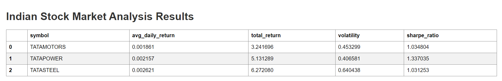
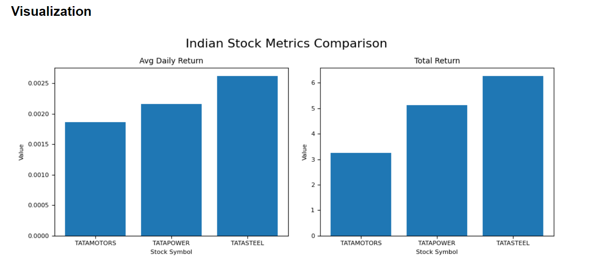
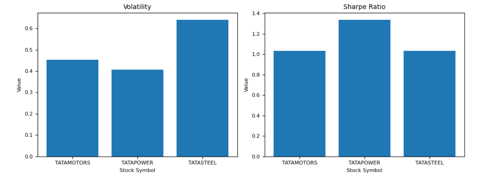

# Indian Stock Market Analyzer

This project is a Python-based stock market analyzer that fetches data for Indian stocks (specifically Tata Motors, Tata Steel, and Tata Power), performs financial calculations, and presents the results through both a command-line interface and a web interface.

## Features

- Fetches historical stock data from Yahoo Finance
- Calculates key financial metrics including:
  - Daily Returns
  - Cumulative Returns
  - Total Return
  - Volatility
  - Sharpe Ratio
- Stores processed data in an SQLite database
- Provides data visualization through matplotlib
- Offers a web interface to view results using Flask

## Prerequisites

- Python 3.7+
- pip (Python package manager)

## Installation

1. Clone this repository

2. Create a virtual environment:
   python -m venv venv

3. Activate the virtual environment:
- On Windows:
  ```
  venv\Scripts\activate
  ```
- On macOS and Linux:
  ```
  source venv/bin/activate
  ```

4. Install the required packages:
  pip install -r requirements.txt

## Project Structure

- `indian_stock_analyzer.py`: Main script for fetching and processing stock data
- `analyze_results.py`: Script for analyzing the processed data
- `app.py`: Flask web application
- `templates/index.html`: HTML template for the web interface
- `requirements.txt`: List of Python package dependencies
- `indian_stock_data.db`: SQLite database storing the processed stock data

## Results

Here's a visual representation of our stock analysis:



PS: A little attempt to understand pipeline